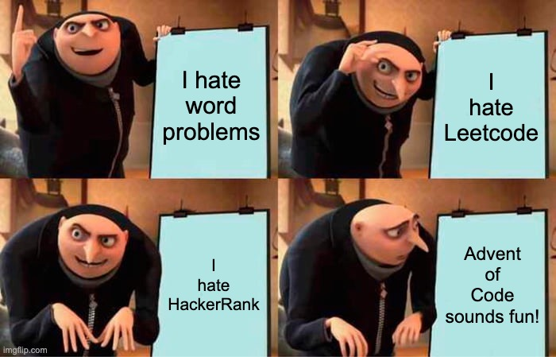
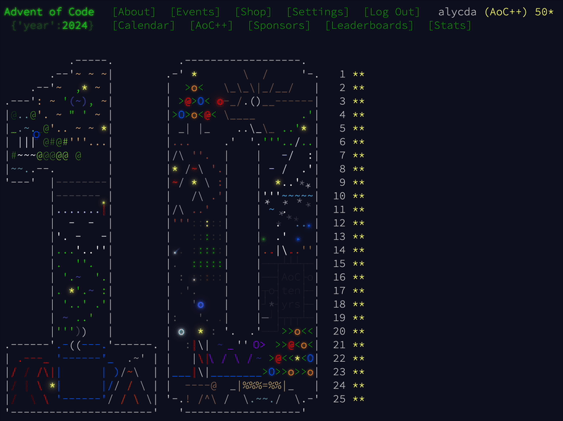

---
theme:
    name: catppuccin-mocha
    override:
        footer:
            style: template
            left: "Learning in Public : AOC FFI Playground"
            center: github.com/alycda/learning-in-public/tree/aoc-ffi
---

<!-- font_size: 7 -->

Advent of Code → Rust FFI
===

<!-- new_lines: 2 -->

<!-- speaker_note: |
    First of all, I hate LeetCode. I hate HackerRank. Word problems make me miserable. I'd never done Advent of Code before 2024.

    But after months of therapy sessions with the Rust compiler—fighting mutable strings across threads, wrestling with lifetimes—I needed wins. Small victories. And I'm competitive, remember the motorcycle?
 -->

<!-- end_slide -->

<!-- skip_slide -->

I like winning!
===

<!-- no_footer -->
<!-- end_slide -->

<!-- font_size: 7 -->

Advent of Code → Rust FFI
===

<!-- speaker_note: |
    So that December, I joined the company's AoC challenge. Who doesn't want to save Christmas?

    **Took 3rd place.** Behind a Java wizard and a Pythonista. They'd been coding for decades in those languages. I'd been writing Rust for months.

    **November 2025:** I'm onboarding at Ditto, learning their FFI patterns for a dozen platforms. And I think: "I learned Rust through AoC. What if I could systematically reinfornce the ffi I recently learned and deployed the exact same way?"

    Went back to those 2024 puzzles. Started experimenting publicly on GitHub.
 -->

<!-- end_slide -->
